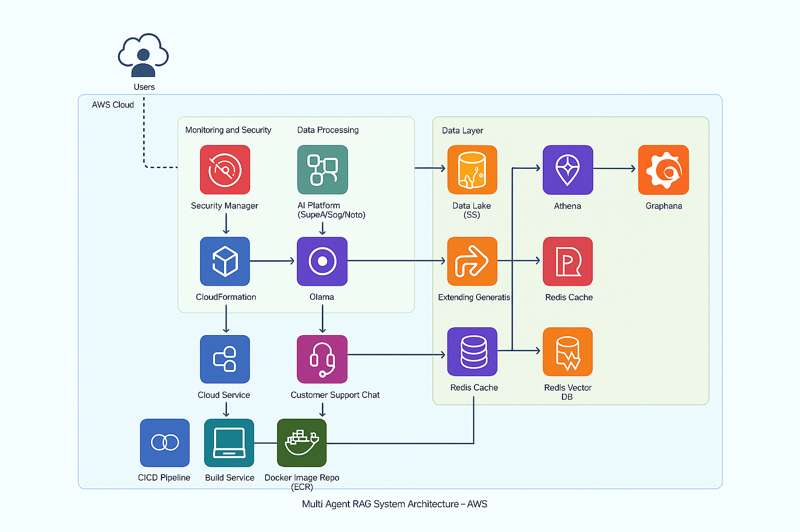

# 🧠 Multi-Agent RAG Customer Support System using Ollama

## 🚀 What is this project?

This project implements a **multi-agent Retrieval-Augmented Generation (RAG)** system for customer support, powered by **Ollama**. It uses [LangChain](https://www.langchain.com/), [LangGraph](https://github.com/langchain-ai/langgraph), and a modular agent-based architecture to intelligently route queries about orders, returns, deliveries, and product info to specialized assistants.

  
📺 [Watch Demo Video](https://youtu.be/mPBYvSJuN8Q?si=TGmtyp-XK5O5xQV7)

---

## 🧠 Powered by Ollama

We use **Ollama** to run open-source LLMs like `llama2`, `mistral`, or `gemma` locally, enabling:
- Local inference
- Data privacy
- Low-latency responses
- Offline-friendly deployment

---

## 🗺️ Architecture Overview

The system is built as a **LangGraph state machine** where agents and tool nodes pass control based on conversation state and intent.

### Agents

- `Primary Assistant`: Entry point that routes queries to other agents.
- `Order Agent`: Places/tracks orders.
- `Returns Agent`: Manages returns/refunds.
- `Delivery Agent`: Answers logistics/delivery questions.
- `Product Agent`: Provides product info and suggestions.

### Core Features

- Multi-agent routing via LangGraph
- Vector search via Qdrant
- Memory/state via Redis
- Safe vs. sensitive tool use
- Integrated observability via LangSmith


---

## ☁️ Suggested AWS Architecture



| Layer            | Components                                                                 |
|------------------|-----------------------------------------------------------------------------|
| **Data Layer**   | S3 (raw/clean/gold), Athena, Redshift, Qdrant (Vectors), ElastiCache (Redis) |
| **Processing**   | Airflow on EKS, EC2 embedding jobs, SageMaker/Bedrock (optional)            |
| **Chat Service** | EKS (LLM chat API), API Gateway, Ollama backend                             |
| **CI/CD**        | CodePipeline, CodeBuild, Docker (ECR)                                       |
| **Monitoring**   | CloudWatch, Grafana, Secrets Manager                                        |

---

## 🔍 Observability with LangSmith

LangSmith tracks:
- Agent tool usage
- Vector search results
- Generated responses
- Model confidence
- Error traces


---

## 🧪 Requirements

- Python 3.12+
- [Poetry](https://python-poetry.org/docs/#installation)
- Docker & Docker Compose
- [Ollama](https://ollama.com/)
- LangSmith API key (optional)

---

## 🛠️ Setup Guide

### 1. Clone the repository
```bash
git clone https://github.com/Vivek17020/SupportHive.git
cd SupportHive
```

### 2. Setup environment
```bash
cp .dev.env .env
```

Update `.env` file with:
```env
OLLAMA_MODEL=llama2
LANGCHAIN_TRACING_V2=true
LANGCHAIN_API_KEY=your_langsmith_key # Optional
```

### 3. Install dependencies
```bash
poetry install
```

### 4. Generate vector embeddings
```bash
poetry run python vectorizer/app/main.py
```

### 5. Start Qdrant vector database
```bash
docker compose up qdrant -d
```

### 6. Run customer support system
```bash
poetry run python ./customer_support_chat/app/main.py
```

> Access Qdrant UI at: [http://localhost:6333/dashboard#](http://localhost:6333/dashboard#)

---

## 🧾 Project Structure

```text
├── vectorizer/                  # Embedding generation pipeline
├── customer_support_chat/       # Main multi-agent chat system
├── graphs/                      # LangGraph system graphs
├── images/                      # Architecture and demo visuals
├── .env                         # Environment configuration
├── docker-compose.yml           # Services: Qdrant, Ollama (optional)
├── README.md
```

---

## 📊 Data Sources

- **Travel DB (template)**: LangGraph Travel Benchmark
- 

- **Qdrant**:Stores embeddings for vector search
-  
- **Redis**: Maintains chat memory and conversation history
- **Local documents**: (Can include product catalogs, FAQs, order info, etc.)

---

## 💡 Enhancements / Next Steps

### 🔍 Tool Upgrades
- ✅ **Adaptive RAG**: Smarter query refinement for vector tools
- 🔄 **Corrective RAG**: Retry if poor grounding from vectors
- 🧠 **Self-RAG**: Rerank outputs based on grounding score

### 🧠 Agent Memory
- Redis-based memory per customer session
- Agents remember recent intents, issues, preferences

### 🤖 LangGraph Optimization
- Richer conditional logic for agent handoffs
- Fallback flows (retry failed tool calls with alternate agents)

---

## 🛠️ Tech Stack

- 🧠 **Ollama** — local LLM runtime
- 🔗 **LangGraph & LangChain** — multi-agent orchestration
- 🔍 **Qdrant** — vector search engine
- 🐍 **Python + Poetry**
- 🐳 **Docker + Docker Compose**
- 📈 **Grafana, CloudWatch** — observability
- 🔐 **Secrets Manager** — secure API key storage

---

## 👥 Team & Context

This project was built as part of the **Hack the Future: GenAI Sprint**.  
Our solution addresses **customer support automation** using **multi-agent AI systems** deployed locally and scalably using **Ollama** and AWS-native tools.

---

## 📎 Useful Links

- [LangGraph Adaptive RAG](https://langchain-ai.github.io/langgraph/tutorials/rag/langgraph_adaptive_rag/)
- [Corrective RAG Paper](https://arxiv.org/abs/2401.15884)
- [LangGraph Self-RAG Tutorial](https://langchain-ai.github.io/langgraph/tutorials/rag/langgraph_self_rag_local/)
- [Ollama Docs](https://ollama.com/)
